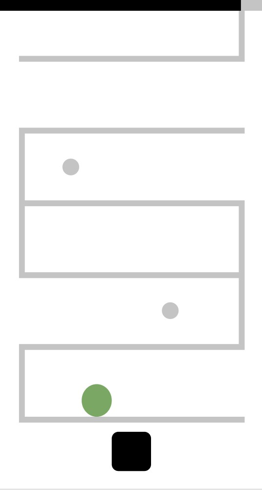
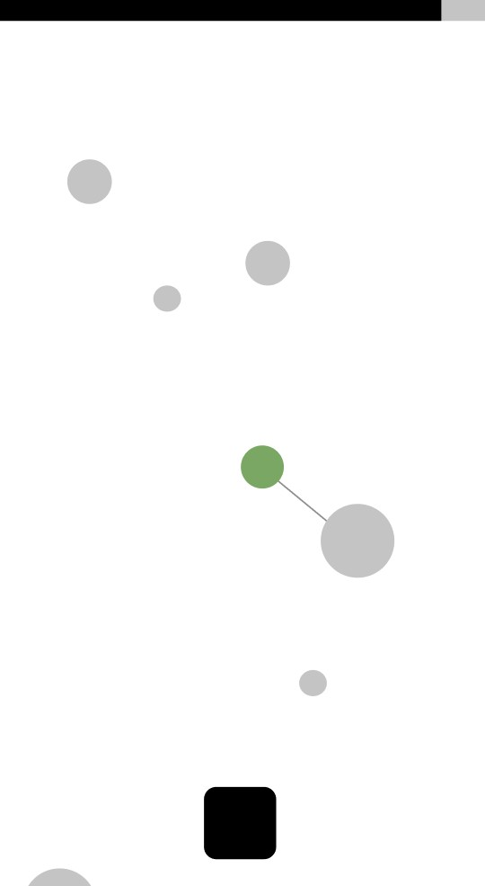
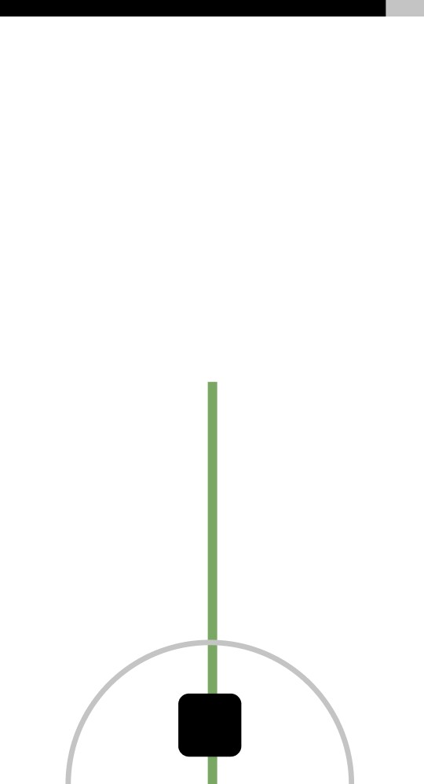

# Game Examples

The 3 examples in this folder show how the Javascript files have been altered to create the games. All games have one button functionality, infinate play and a timer.

## High Riser
* **Aim:** the player constantly moving from left to right. Clicking on the button makes the player jump on the next floor where there are no walls or 1 wall or both walls.
* **Time extention:** collects items.
* **Game Over:** the player falls from the sides or timer runs out.

 

## Sling Shooter
* **Aim:** the player rotates around nodes to create velocity to go to the next node. The player can go up or down.
* **Time extention:** the player rotates around the nodes.
* **Game Over:** the player hits the sides or timer runs out.

 

## Tower Angle
* **Aim:** the tower rotates from side to side and the player has to pin the tower at the angle they are given. The tower will rotate faster whith each level.
* **Time extention:** get the right angle.
* **Game Over:** the tower is not at the right angle or timer runs out.

 